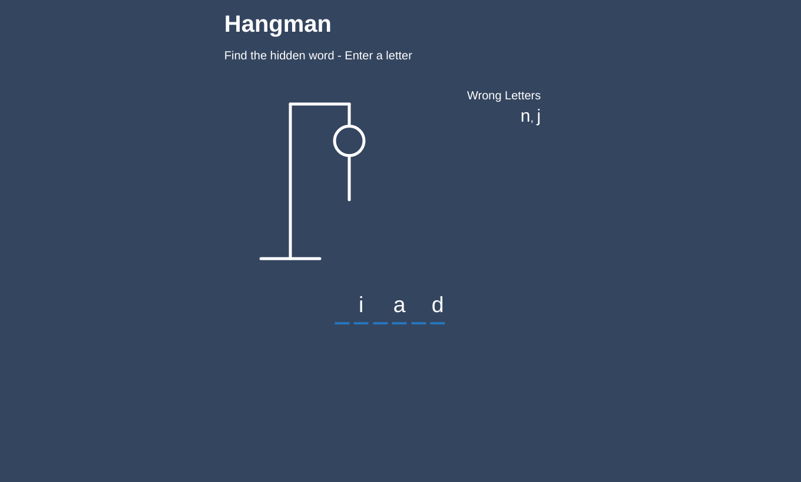
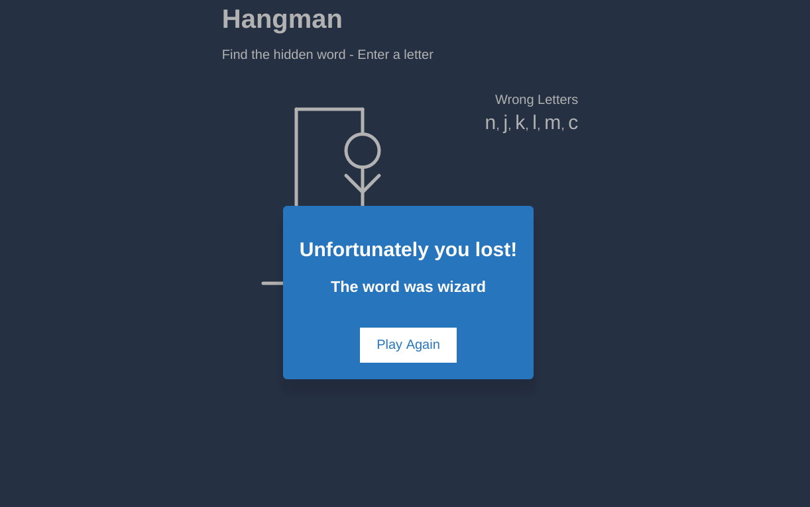

# Hangman Game

This is the popular word game called Hangman where the user needs to guess a game in a specific number of tries.

# How it works

1. The user needs to guess a game within a specific number of tries.
2. If the user exceeds the number of tries, then he or she loses.

# Screenshots



# Built with 

1. React Hooks

# Live Demo

https://hangmanbypinkman.netlify.app/


# To Run 

1. Clone into repo
2. Run ``` npm i ```
3. Run ``` npm start ```
4. Visit ``` localhost:3000 ```

